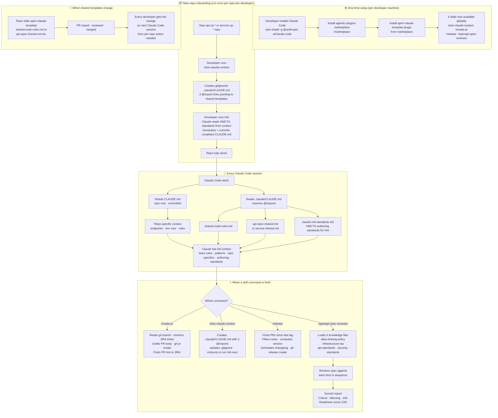

# apim-claude-template

Shared [Claude Code](https://claude.ai/claude-code) skills and CLAUDE.md templates for the HMCTS APIM team.
Provides a single source of truth for AI context across all `api-cp-*` and `service-cp-*` repos — maintained once here, live-imported everywhere.

---

## How it works

Each `api-cp-*` / `service-cp-*` repo carries two context files that Claude Code loads automatically on every session:

| File | Committed? | Owned by | Contains |
|---|---|---|---|
| `CLAUDE.md` (repo root) | Yes | Each repo | Repo-specific: endpoints, env vars, infra, architecture rules |
| `.claude/CLAUDE.md` | No — gitignored | Developer local | 3 `@import` lines pointing to shared templates here |

The `.claude/CLAUDE.md` for an `api-cp-*` repo looks like:
```
@../../apim-claude-template/templates/shared-code-rules.md
@../../apim-claude-template/templates/api-spec-shared.md
@../../apim-claude-template/templates/claude-md-standards.md
```

For a `service-cp-*` repo, the second line is `service-shared.md` instead of `api-spec-shared.md`.

When a shared template changes here, all repos pick it up automatically — no per-repo commits needed.
When a repo's architecture changes, update `CLAUDE.md` in that repo — no apim-claude-template PR needed.

---

## Workflow



| Phase | Who | When |
|---|---|---|
| **Install** | Each developer | Once per machine |
| **Onboard repo** | Repo creator | Once per new repo |
| **Session** | Automatic | Every Claude Code session |
| **Command** | Developer | On demand |
| **Propagate** | Team via PR | When standards change |

---

## Skills

| Command | What it does |
|---|---|
| `/wire-claude-context` | Create the gitignored `.claude/CLAUDE.md` with 3 shared template imports — run once per repo per developer, then run `/init` to generate the committed `CLAUDE.md` |
| `/create-pr` | Draft and raise a GitHub PR with JIRA integration — extracts ticket from branch, transitions JIRA status |
| `/release` | Cut a GitHub release — finds PRs merged since last tag, filters noise, computes next version, generates changelog, creates the release via `gh` CLI |
| `/openapi-spec-reviewer` | Review an OpenAPI v3 spec against four lenses: data-sharing policy, infrastructure SLA, HMCTS API standards, and security standards |

---

## Getting started (existing team member, existing repo)

### 1. One-time machine setup

```bash
npm install -g @anthropic-ai/claude-code
claude          # log in

brew install gh
gh auth login
```

Add to `~/.zshrc`:

```bash
export JIRA_TOKEN=<your-jira-personal-access-token>
```

Generate at: **JIRA → Profile → Personal Access Tokens**

### 2. Clone repos as siblings

All repos must be cloned into the **same parent directory** — the `@import` paths use `../../apim-claude-template/` which requires this layout:

```
~/HMCTS/APIM/
├── apim-claude-template/     ← this repo
├── api-cp-<name>/
├── api-cp-<name>/
├── service-cp-<name>/
└── service-cp-<name>/
```

### 3. Set up Claude context in each repo you work on

```bash
cd api-cp-<repo-name>
/wire-claude-context   # creates gitignored .claude/CLAUDE.md with 3 @imports
/init                  # generates committed CLAUDE.md using HMCTS standards now in context
```

Claude Code will load shared rules + category standards + authoring standards + repo-specific guidance on every session.

---

## Adding a new repo

> See [CONTRIBUTING.md](CONTRIBUTING.md) for the full checklist.

```bash
# 1. Clone the new repo as a sibling of apim-claude-template
cd ~/HMCTS/APIM
git clone git@github.com:hmcts/api-cp-<new-name>.git

# 2. Wire shared context — creates .claude/CLAUDE.md with 3 @import lines
cd api-cp-<new-name>
/wire-claude-context

# 3. Generate repo-specific CLAUDE.md — /init now has HMCTS standards in context
/init
# Commits CLAUDE.md to this repo — raise a PR with that commit
```

---

## Structure

```
apim-claude-template/
├── templates/
│   ├── shared-code-rules.md    ← team-wide code rules (all repos)
│   ├── api-spec-shared.md      ← shared guidance for all api-cp-* repos
│   ├── service-shared.md       ← shared guidance for all service-cp-* repos
│   └── claude-md-standards.md ← HMCTS authoring standards for /init (what to include, what to omit, debt flags)
└── skills/
    ├── wire-claude-context/
    ├── create-pr/
    ├── release/
    └── openapi-spec-reviewer/
        └── knowledge/
            ├── data-sharing-policy.md   ← UK GDPR / DPA 2018 rules
            ├── infrastructure-sla.md    ← Azure APIM / AKS SLA targets
            ├── api-standards.md         ← HMCTS RESTful API standards
            └── security-standards.md   ← OAuth 2, TLS, input validation

Each api-cp-* / service-cp-* repo:
├── CLAUDE.md                   ← committed — repo-specific context
└── .claude/
    ├── CLAUDE.md               ← gitignored — 3 shared @import lines
    └── settings.local.json     ← gitignored — personal local overrides

apim-claude-template itself:
└── .claude/
    └── settings.json           ← committed — canonical plugin set and CP permissions
```

---

## Updating shared content

| Change | File to edit | Who acts | Propagation |
|---|---|---|---|
| Team-wide code rule | `templates/shared-code-rules.md` | Any developer | Automatic — all repos |
| API spec pattern | `templates/api-spec-shared.md` | Any developer | Automatic — all `api-cp-*` |
| Service pattern | `templates/service-shared.md` | Any developer | Automatic — all `service-cp-*` |
| One repo's architecture | Update `CLAUDE.md` in that repo | Repo owner | Committed in same PR as code change |
| HMCTS CLAUDE.md authoring standards | `templates/claude-md-standards.md` | Any developer | Automatic — all repos on next session; re-run `/init` in each repo to apply any new section requirements to existing `CLAUDE.md` files |
| OpenAPI review policy | `skills/openapi-spec-reviewer/knowledge/` | APIM team | Automatic — all reviewers |

All changes go through a PR against `master`. One merged PR = all repos updated.

---

## POC outcomes

Produced by running `/create-pr` on a real branch against AMP-440:

- **GitHub PR:** https://github.com/hmcts/service-cp-crime-hearing-case-event-subscription/pull/211
- **JIRA comment:** PR link posted automatically to [AMP-440](https://tools.hmcts.net/jira/browse/AMP-440)
- **Confluence release page:** https://tools.hmcts.net/confluence/spaces/AMP/pages/1958295257/Release+AMP-440+-+SIT+Deployment+-+09+Apr+2026

---

## License

MIT
