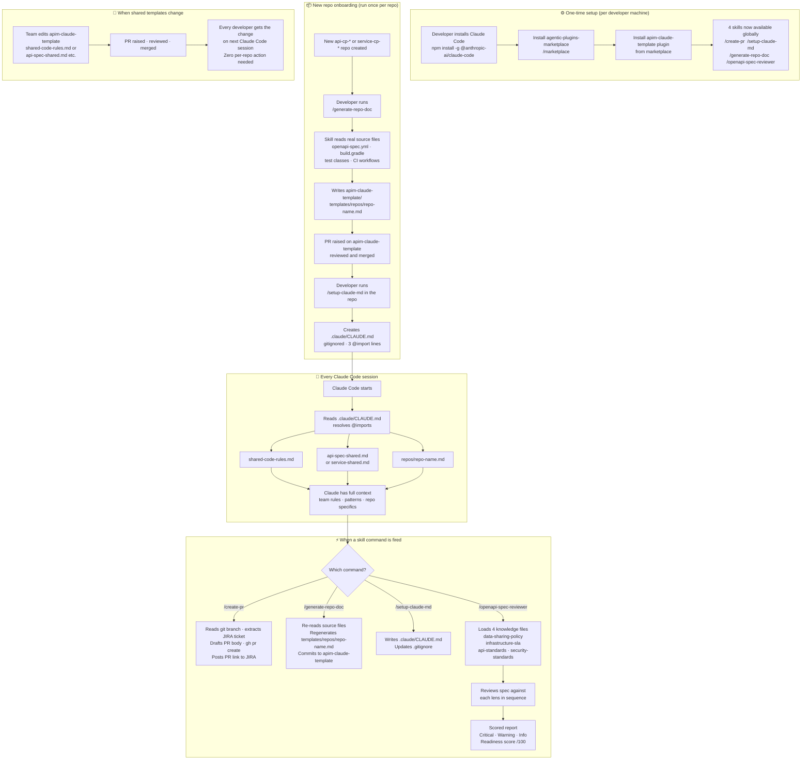

# apim-claude-template

Shared [Claude Code](https://claude.ai/claude-code) skills and CLAUDE.md templates for the HMCTS APIM team.
Provides a single source of truth for AI context across all `api-cp-*` and `service-cp-*` repos — maintained once here, live-imported everywhere.

---

## How it works

Each `api-cp-*` / `service-cp-*` repo has a **local, gitignored** `.claude/CLAUDE.md` containing three `@import` lines:

```
@../../apim-claude-template/templates/shared-code-rules.md
@../../apim-claude-template/templates/api-spec-shared.md
@../../apim-claude-template/templates/repos/api-cp-<repo-name>.md
```

Claude Code resolves these on every session. When a shared template changes here, all repos pick it up automatically — no per-repo commits needed.

---

## Workflow



| Phase | Who | When |
|---|---|---|
| **Install** | Each developer | Once per machine |
| **Onboard repo** | Repo creator | Once per new repo |
| **Session** | Automatic | Every Claude Code session |
| **Command** | Developer | On demand |
| **Propagate** | Team via PR | When standards change |

---

## Skills

| Command | What it does |
|---|---|
| `/create-pr` | Draft and raise a GitHub PR with JIRA integration — extracts ticket from branch, transitions JIRA status |
| `/setup-claude-md` | Bootstrap `.claude/CLAUDE.md` in the current repo — run once per repo per developer |
| `/generate-repo-doc` | Auto-generate a repo-specific template by reading OpenAPI spec, build files, source layout, and CI workflows |
| `/openapi-spec-reviewer` | Review an OpenAPI v3 spec against four lenses: data-sharing policy, infrastructure SLA, HMCTS API standards, and security standards |

---

## Getting started (existing team member, existing repo)

### 1. One-time machine setup

```bash
npm install -g @anthropic-ai/claude-code
claude          # log in

brew install gh
gh auth login
```

Add to `~/.zshrc`:

```bash
export JIRA_TOKEN=<your-jira-personal-access-token>
```

Generate at: **JIRA → Profile → Personal Access Tokens**

### 2. Clone repos as siblings

All repos must be cloned into the **same parent directory** — the `@import` paths use `../../apim-claude-template/` which requires this layout:

```
~/HMCTS/APIM/
├── apim-claude-template/     ← this repo
├── api-cp-<name>/
├── api-cp-<name>/
├── service-cp-<name>/
└── service-cp-<name>/
```

### 3. Set up Claude context in each repo you work on

```bash
cd api-cp-<repo-name>
/setup-claude-md
```

That's it. Claude Code will load shared rules + category standards + repo-specific guidance on every session.

---

## Adding a new repo

> **Required before the first developer runs `/setup-claude-md`.**
> See [CONTRIBUTING.md](CONTRIBUTING.md) for the full checklist.

```bash
# 1. Clone the new repo as a sibling of apim-claude-template
cd ~/HMCTS/APIM
git clone git@github.com:hmcts/api-cp-<new-name>.git

# 2. Generate the repo-specific template
cd api-cp-<new-name>
/generate-repo-doc

# 3. Raise a PR on apim-claude-template for the generated file
cd ../../apim-claude-template
gh pr create --base master \
  --head dev/add-api-cp-<new-name> \
  --title "feat: add repo template for api-cp-<new-name>"

# 4. After the PR is merged, set up local Claude context
cd ../api-cp-<new-name>
/setup-claude-md
```

---

## Template structure

```
templates/
├── shared-code-rules.md        ← code rules identical for all repos
├── api-spec-shared.md          ← shared guidance for all api-cp-* repos
├── service-shared.md           ← shared guidance for all service-cp-* repos
└── repos/
    ├── api-cp-<name>.md        ← auto-generated per repo
    └── service-cp-<name>.md

skills/
├── create-pr/
├── setup-claude-md/
├── generate-repo-doc/
└── openapi-spec-reviewer/
    └── knowledge/
        ├── data-sharing-policy.md   ← UK GDPR / DPA 2018 rules
        ├── infrastructure-sla.md    ← Azure APIM / AKS SLA targets
        ├── api-standards.md         ← HMCTS RESTful API standards
        └── security-standards.md   ← OAuth 2, TLS, input validation
```

---

## Updating shared content

| Change | File to edit | Who acts | Propagation |
|---|---|---|---|
| Team-wide code rule | `templates/shared-code-rules.md` | Any developer | Automatic — all repos |
| API spec pattern | `templates/api-spec-shared.md` | Any developer | Automatic — all `api-cp-*` |
| Service pattern | `templates/service-shared.md` | Any developer | Automatic — all `service-cp-*` |
| One repo's architecture | `/generate-repo-doc` in that repo | Repo owner | Automatic after PR merged |
| OpenAPI review policy | `skills/openapi-spec-reviewer/knowledge/` | APIM team | Automatic — all reviewers |

All changes go through a PR against `master`. One merged PR = all repos updated.

---

## POC outcomes

Produced by running `/create-pr` on a real branch against AMP-440:

- **GitHub PR:** https://github.com/hmcts/service-cp-crime-hearing-case-event-subscription/pull/211
- **JIRA comment:** PR link posted automatically to [AMP-440](https://tools.hmcts.net/jira/browse/AMP-440)
- **Confluence release page:** https://tools.hmcts.net/confluence/spaces/AMP/pages/1958295257/Release+AMP-440+-+SIT+Deployment+-+09+Apr+2026

---

## License

MIT
